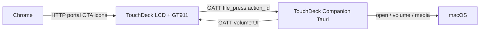

# TouchDeck — Giới thiệu hệ thống & Hướng dẫn sử dụng

TouchDeck là bàn phím cảm ứng 7" (board **JC8048W550C**, ESP32-S3) dùng để mở app trên macOS và chỉnh volume/media qua Companion Tauri (BLE GATT) — cấu hình qua Companion hoặc web portal.

| | |
|---|---|
| Repo | https://github.com/vthang87/touchdeck |
| Trang giới thiệu + HDSD | https://vthang87.github.io/touchdeck/ |
| Cài firmware (USB) | https://vthang87.github.io/touchdeck/setup.html |
| Portal (đã nối Wi‑Fi) | http://touchdeck.local |
| Grid editor | http://touchdeck.local/grid |

---

## 1. Hệ thống gồm những gì?



| Thành phần | Vai trò |
|---|---|
| **Firmware trên board** | UI LVGL, BLE GATT peripheral, Wi‑Fi portal / OTA / icon |
| **TouchDeck Companion** (Tauri, macOS) | Scan/connect BLE, map `action_id` → mở app / volume / media / keyboard |
| **Config portal** | Wi‑Fi, Bluetooth pairing, idle, tên thiết bị |
| **Grid editor** | Lưới nút + `action_id` (+ legacy target tùy chọn) |
| **Web installer** | Flash firmware qua USB (Chrome/Edge) |

Kênh chính: **Bluetooth GATT**. Wi‑Fi chỉ còn portal / OTA / icon — không còn WebSocket launch.
---

## 2. Màn hình trên desk

Cấu hình hiện tại trên thiết bị: **5×2**, tên **Thang Dev**, volume hiển thị từ Mac.


> Ảnh chụp trực tiếp từ LVGL trên board (`GET /api/screenshot`).

**Chụp lại màn hình:**

```bash
./scripts/capture-screenshot.sh              # → docs/images/home-grid.png
./scripts/capture-screenshot.sh 192.168.0.183
```

**Ý nghĩa thanh trạng thái (góc phải):**

| Icon | Ý nghĩa |
|---|---|
| Volume % | Mức loa Mac (Companion đẩy qua GATT) |
| Bluetooth | Xanh = GATT central đã nối; `pair` / `idle` / `off` |
| ⇅ | Xanh = companion GATT linked; xám = chưa nối → tile host bị mờ |
| Wi‑Fi | Xanh = STA; vàng = đang AP setup |

Hàng trên: Vol − / Mute / Vol + / Telegram / Safari  
Hàng dưới: iTerm / ChatGPT / Codex / Cursor / VS Code

---

## 3. Cài đặt lần đầu

### 3.1 Flash firmware

Cách nhanh nhất — Chrome/Edge + USB‑C **có data**:

1. Mở [trình cài firmware](https://vthang87.github.io/touchdeck/setup.html)
2. **Kết nối USB** → chọn cổng ESP32‑S3
3. (Khuyên dùng lần đầu) bật xóa flash → **Ghi firmware**


Giới thiệu & HDSD trên Pages: https://vthang87.github.io/touchdeck/

Hoặc local:

```bash
./scripts/prepare-web-firmware.sh
cd web && pnpm serve   # http://127.0.0.1:8787
```

Chi tiết: [`web-install.md`](web-install.md).

### 3.2 Kết nối Wi‑Fi

1. Board chưa có Wi‑Fi → phát AP `TouchDeck-Setup-XXXX`, mật khẩu `touchdeck`
2. Mở http://192.168.4.1 → nhập SSID / mật khẩu / tên thiết bị / hostname / OTA password
3. **Save & Restart** → sau đó vào bằng http://touchdeck.local


### 3.3 Bluetooth (GATT)

1. Trên board: bật **Bluetooth enabled** (+ **Pairing mode** lần đầu) trong portal / Companion → **Device**
2. Trên Mac: cấp quyền **Bluetooth** cho TouchDeck Companion (System Settings → Privacy & Security → Bluetooth)
3. Companion → **Scan BLE** → **Connect** tới `TouchDeck-XXXX`

Không ghép như bàn phím HID — Companion là GATT central. Volume/media do app xử lý (không có HUD hệ thống).

### 3.4 Companion trên Mac (Tauri)

**Tải nhanh (Apple Silicon):**  
[TouchDeck-Companion-0.3.0-mac-arm64.dmg](https://github.com/vthang87/touchdeck/releases/latest/download/TouchDeck-Companion-0.3.0-mac-arm64.dmg) · [Tất cả releases](https://github.com/vthang87/touchdeck/releases/latest)

1. Mở `.dmg` → kéo **TouchDeck Companion.app** vào Applications  
2. Chạy app. Lần đầu nếu macOS chặn: chuột phải → **Open** / Privacy & Security → Open Anyway  
3. Tab **Connect** → **Scan BLE** → Connect  
4. Cấp **Accessibility** (media / keyboard / volume simulation)

Tabs hữu ích:

| Tab | Việc làm |
|---|---|
| **Connect** | Scan/Connect BLE, virtual keyboard, auto-reconnect |
| **Grid** / **Device** | Cấu hình board qua Wi‑Fi (`touchdeck.local`) |
| **Profile** | Map `action_id` → open_app / media / volume / keyboard |
| **Log** | Sự kiện GATT / lỗi |

Tự build:

```bash
cd companion && pnpm install && pnpm run dist
```

Source Electron cũ (WebSocket): [`../archive/companion-electron/`](../archive/companion-electron/).


Khi GATT đã nối, icon ⇅ trên màn hình xanh và các nút mở app sáng lại.

---

## 4. Hướng dẫn sử dụng hàng ngày

### 4.1 Mở ứng dụng

Chạm tile **App** — Companion nhận GATT `tile_press` với `action_id` và chạy `/usr/bin/open` theo map SQLite.

Nếu tile **mờ**: Companion chưa nối BLE — Scan + Connect lại.

### 4.2 Volume & media

Tất cả media/volume do Companion xử lý (không còn BLE HID trên board). Volume ± khoảng 3%, **không có HUD hệ thống** macOS. Mute / play / next / prev cần quyền **Accessibility**.

### 4.3 Màn hình nghỉ (idle)

Mặc định (đổi được trong portal / Companion → Device):

| Sau | Hành động |
|---|---|
| 30 s | Dim xuống ~30% |
| 120 s | Màn hình đồng hồ |
| 300 s | Dim 2 (~30%) |
| 1800 s (30 phút) | Tắt backlight |

Chạm để đánh thức. **Lần chạm wake từ đồng hồ/tắt màn không kích hoạt nút** — nhấc tay rồi chạm lần nữa mới bấm tile.

Cỡ chữ đồng hồ: **Clock font size** (48 / 72 / 96 / 128 / 160 px).

### 4.4 Cảnh báo duyệt Cursor / Codex

Chưa nằm trong MVP v4 (GATT). Bản Electron cũ (`archive/companion-electron/`) dùng WebSocket — xem [`approval-notifications.md`](approval-notifications.md) (legacy).

---

## 5. Tuỳ chỉnh lưới nút

Mở http://touchdeck.local/grid:

1. Chọn **Columns** / **Rows** (2–5 × 1–3)
2. Mỗi ô: `label`, `icon`, `color`, `action`, **`action_id`**
3. Action `app` có thể giữ legacy `target` (bundle/path) để gợi ý; Companion map theo `action_id`
4. Upload PNG icon lên thẻ SD nếu cần
5. **Save to device** — áp dụng ngay

Companion tab **Profile** chỉnh map `action_id` → bundle / media / keyboard. Tab **Grid** / **Device** chỉnh board qua HTTP (cùng API portal).

---

## 6. Cập nhật firmware

| Cách | Lệnh / URL |
|---|---|
| USB Web Installer | https://vthang87.github.io/touchdeck/setup.html |
| PlatformIO USB | `cd firmware && pio run -e usb -t upload` |
| OTA | `cd firmware && pio run -e ota -t upload --upload-port touchdeck.local` |

Mật khẩu OTA mặc định: `touchdeck`. Chi tiết: [`ota-process.md`](ota-process.md).

---

## 7. Xử lý sự cố nhanh

| Hiện tượng | Việc kiểm tra |
|---|---|
| Nút mờ / không mở app | Companion đã Connect BLE? Icon BT xanh? |
| Mute / media không chạy | Accessibility cho Companion? |
| Volume không có HUD | Đúng hành vi v4 (không BLE HID) |
| Dim thành tắt hẳn | PWM backlight 1 kHz; **Dim brightness %** ≥ ~20 |
| Wake bị bấm nhầm tile | Đã chặn; nhấc tay rồi chạm lại |
| Portal không mở | Thử IP hoặc AP setup |
| Flash Web Serial lỗi | Chrome/Edge, cáp data, cổng ESP32‑S3 |

---

## 8. Tài liệu kỹ thuật liên quan

- [`../companion/README.md`](../companion/README.md) — companion Tauri
- [`../archive/companion-electron/`](../archive/companion-electron/) — companion Electron (legacy)
- [`../protocol/gatt.md`](../protocol/gatt.md) — GATT protocol v4
- [`provisioning.md`](provisioning.md) — Wi‑Fi / BLE setup
- [`web-install.md`](web-install.md) — flash qua trình duyệt
- [`ble-protocol.md`](ble-protocol.md) — legacy v3 notes
- [`approval-notifications.md`](approval-notifications.md) — approve (legacy / phase sau)
- [`ota-process.md`](ota-process.md) — OTA
- [`cloudflare-worker.md`](cloudflare-worker.md) — deploy installer (tuỳ chọn)

---

## Ảnh trong tài liệu

| File | Nội dung |
|---|---|
| `images/home-grid.png` | Màn hình desk — LVGL snapshot qua `/api/screenshot` |
| `images/grid-editor.png` | Grid editor trên board |
| `images/device-settings.png` | Portal Wi‑Fi / idle / Bluetooth |
| `images/companion-ui.png` | TouchDeck Companion |
| `images/web-installer.png` | GitHub Pages installer |
| `images/home-grid-mock.html` | Mock HTML (tham khảo, không còn dùng làm ảnh chính) |

---

## License

[MIT](../LICENSE) © 2026 Thang Dang
