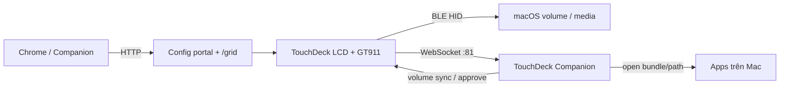
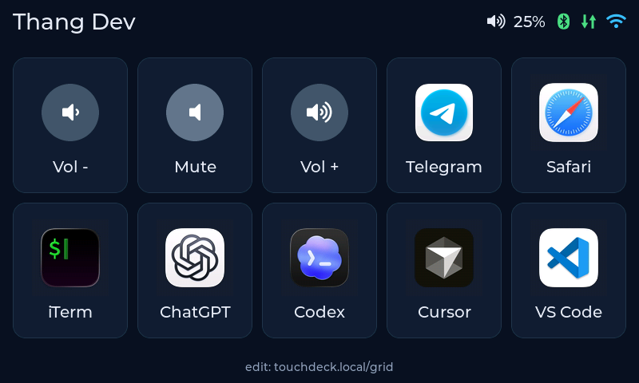
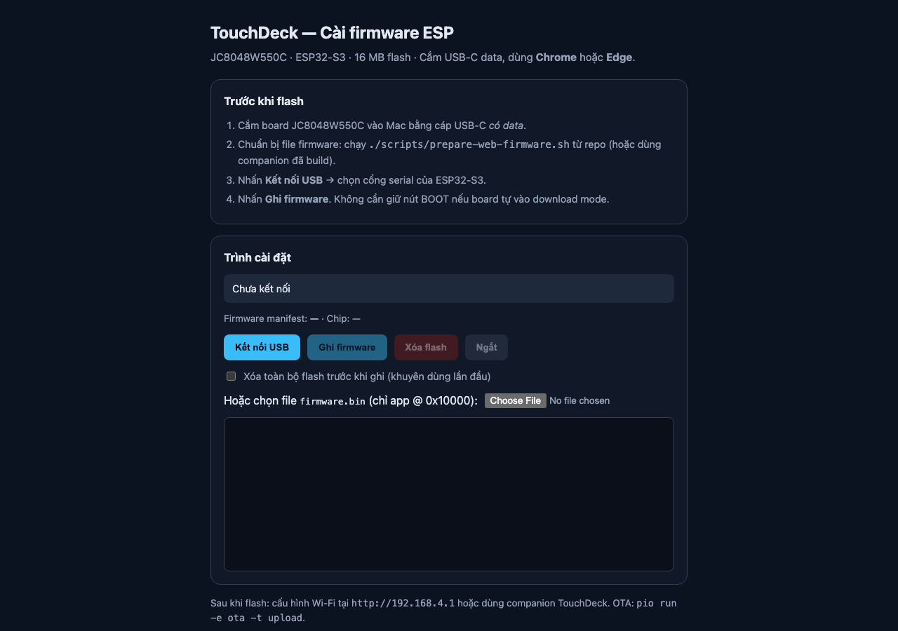
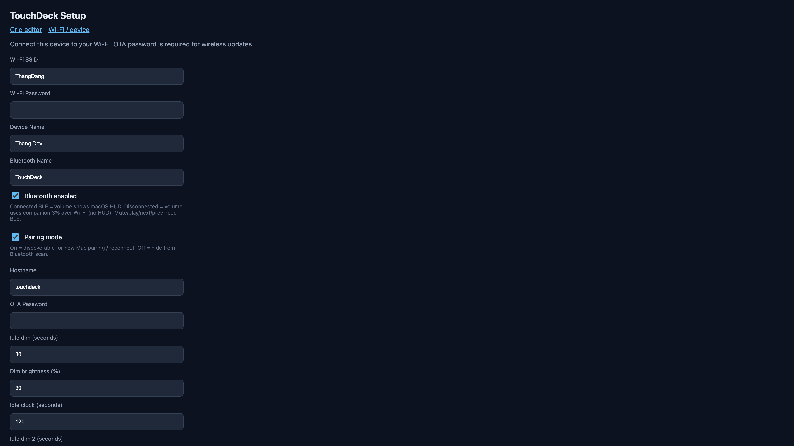
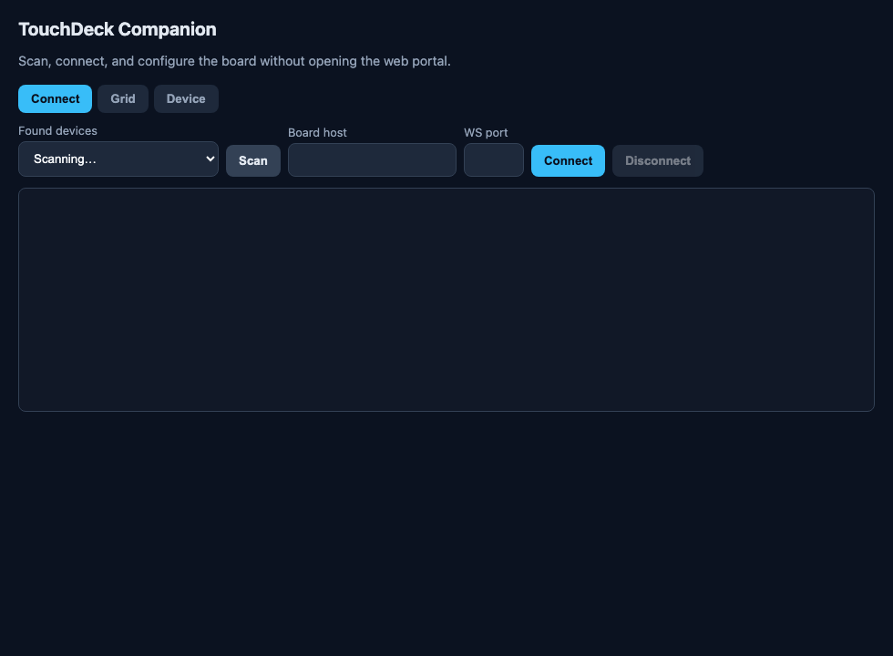
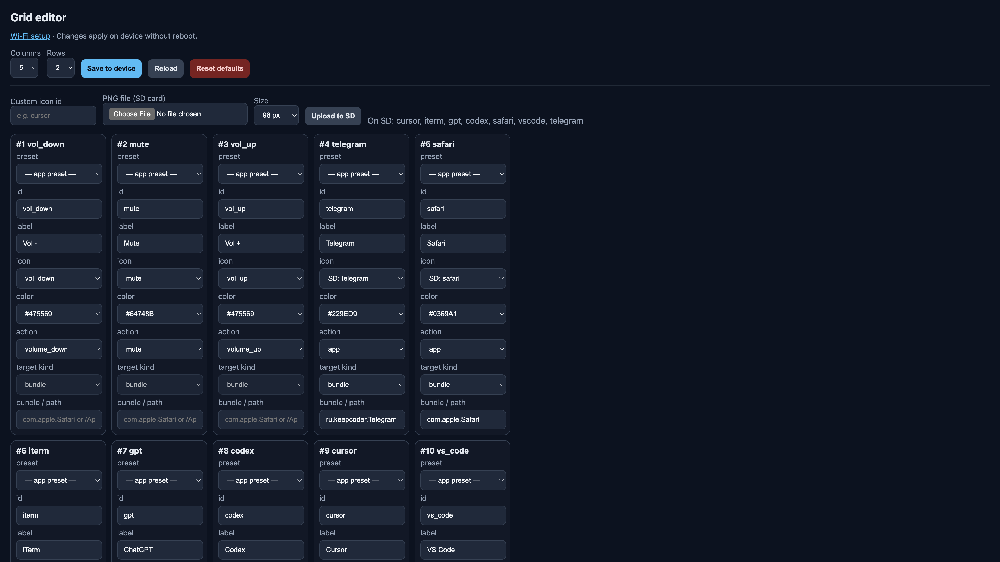

# TouchDeck — Giới thiệu hệ thống & Hướng dẫn sử dụng

TouchDeck là bàn phím cảm ứng 7" (board **JC8048W550C**, ESP32-S3) dùng để mở app trên macOS, chỉnh volume/media và nhận thông báo duyệt lệnh từ Cursor/Codex — cấu hình qua Companion hoặc web portal.

| | |
|---|---|
| Repo | https://github.com/vthang87/touchdeck |
| Trang giới thiệu + HDSD | https://vthang87.github.io/touchdeck/ |
| Cài firmware (USB) | https://vthang87.github.io/touchdeck/setup.html |
| Portal (đã nối Wi‑Fi) | http://touchdeck.local |
| Grid editor | http://touchdeck.local/grid |

---

## 1. Hệ thống gồm những gì?



| Thành phần | Vai trò |
|---|---|
| **Firmware trên board** | UI LVGL (grid / đồng hồ idle), BLE HID, Wi‑Fi, WebSocket, portal, OTA |
| **TouchDeck Companion** (Electron, macOS) | Nhận `tile_press`, mở app; đồng bộ volume; đẩy cảnh báo approve Cursor/Codex |
| **Config portal** | Cấu hình Wi‑Fi, Bluetooth, idle, tên thiết bị |
| **Grid editor** | Sửa lưới nút, icon SD, action (media / mở app) |
| **Web installer** | Flash firmware qua USB bằng Chrome/Edge |

Hai đường kết nối độc lập:

- **Bluetooth (BLE HID)** — phím media hệ thống (volume có HUD macOS, mute / play / next / prev).
- **Wi‑Fi (WebSocket)** — mở app và đồng bộ trạng thái qua Companion. Không cần GATT (macOS khóa GATT khi board đã là HID).

---

## 2. Màn hình trên desk

Cấu hình hiện tại trên thiết bị: **5×2**, tên **Thang Dev**, volume hiển thị từ Mac.



> Ảnh chụp trực tiếp từ LVGL trên board (`GET /api/screenshot`).

**Chụp lại màn hình:**

```bash
./scripts/capture-screenshot.sh              # → docs/images/home-grid.png
./scripts/capture-screenshot.sh 192.168.0.183
```

**Ý nghĩa thanh trạng thái (góc phải):**

| Icon | Ý nghĩa |
|---|---|
| Volume % | Mức loa Mac (Companion đẩy qua WS) |
| Bluetooth | Xanh = đã ghép HID; `pair` / `idle` / `off` khi chưa sẵn sàng |
| ⇅ | Xanh = có Companion WS; xám = chưa kết nối → **nút mở app bị mờ** |
| Wi‑Fi | Xanh = STA; vàng = đang AP setup |

Hàng trên: Vol − / Mute / Vol + / Telegram / Safari  
Hàng dưới: iTerm / ChatGPT / Codex / Cursor / VS Code

---

## 3. Cài đặt lần đầu

### 3.1 Flash firmware

Cách nhanh nhất — Chrome/Edge + USB‑C **có data**:

1. Mở [trình cài firmware](https://vthang87.github.io/touchdeck/setup.html)
2. **Kết nối USB** → chọn cổng ESP32‑S3
3. (Khuyên dùng lần đầu) bật xóa flash → **Ghi firmware**



Giới thiệu & HDSD trên Pages: https://vthang87.github.io/touchdeck/

Hoặc local:

```bash
./scripts/prepare-web-firmware.sh
cd web && pnpm serve   # http://127.0.0.1:8787
```

Chi tiết: [`web-install.md`](web-install.md).

### 3.2 Kết nối Wi‑Fi

1. Board chưa có Wi‑Fi → phát AP `TouchDeck-Setup-XXXX`, mật khẩu `touchdeck`
2. Mở http://192.168.4.1 → nhập SSID / mật khẩu / tên thiết bị / hostname / OTA password
3. **Save & Restart** → sau đó vào bằng http://touchdeck.local



### 3.3 Bluetooth (media)

1. Bật **Bluetooth enabled** (+ **Pairing mode** lần đầu)
2. Trên Mac: System Settings → Bluetooth → ghép **TouchDeck** / **TouchDeck‑XXXX**
3. Volume Up/Down lúc đã ghép sẽ hiện **HUD** macOS

### 3.4 Companion trên Mac

**Tải nhanh (Apple Silicon):**  
[TouchDeck-Companion-0.2.0-mac-arm64.dmg](https://github.com/vthang87/touchdeck/releases/latest/download/TouchDeck-Companion-0.2.0-mac-arm64.dmg) · [Tất cả releases](https://github.com/vthang87/touchdeck/releases/latest)

1. Mở `.dmg` → kéo **TouchDeck Companion.app** vào Applications  
2. Chạy app (menu bar). Lần đầu nếu macOS chặn: chuột phải → **Open**  
3. Tab **Connect** → Scan / `touchdeck.local` port `81` → **Connect**  
4. Accessibility → bật TouchDeck Companion (cảnh báo Cursor/Codex)

Tự build / Intel Mac:

```bash
cd companion && pnpm install && pnpm run dist
```



Khi WS đã nối, icon ⇅ trên màn hình xanh và các nút mở app sáng lại.

---

## 4. Hướng dẫn sử dụng hàng ngày

### 4.1 Mở ứng dụng

Chạm tile **App** (Telegram, Safari, Cursor…). Companion chạy `/usr/bin/open` với bundle ID hoặc đường dẫn `.app`.

Nếu tile **mờ**: Companion chưa kết nối WS — mở Companion và Connect lại.

### 4.2 Volume & media

| Hành động | BLE đã nối | Chỉ Wi‑Fi (Companion) |
|---|---|---|
| Vol ± | BLE HID + HUD macOS | Bước 3% qua Companion (không HUD) |
| Mute / Play / Next / Prev | BLE HID | Tile **disabled** nếu không có BLE |

### 4.3 Màn hình nghỉ (idle)

Mặc định (đổi được trong portal / Companion → Device):

| Sau | Hành động |
|---|---|
| 30 s | Dim xuống ~30% |
| 120 s | Màn hình đồng hồ |
| 300 s | Dim 2 (~30%) |
| 1800 s (30 phút) | Tắt backlight |

Chạm để đánh thức. **Lần chạm wake từ đồng hồ/tắt màn không kích hoạt nút** — nhấc tay rồi chạm lần nữa mới bấm tile.

Cỡ chữ đồng hồ: **Clock font size** (48 / 72 / 96 / 128 / 160 px).

### 4.4 Cảnh báo duyệt Cursor / Codex

Khi Mac chờ Approve, Companion đẩy notification → deck hiện banner, highlight tile Cursor/Codex, đánh thức màn nếu đang idle.  
Xem [`approval-notifications.md`](approval-notifications.md).

---

## 5. Tuỳ chỉnh lưới nút

Mở http://touchdeck.local/grid (hoặc Companion → tab **Grid**):



1. Chọn **Columns** / **Rows** (2–5 × 1–3)
2. Mỗi ô: `label`, `icon`, `color`, `action` (`volume_*` / `mute` / `app` / …)
3. Action `app` → `target kind` = `bundle` hoặc `path` + giá trị (vd. `com.apple.Safari`)
4. Upload PNG icon lên thẻ SD nếu cần → chọn icon id
5. **Save to device** — áp dụng ngay, không reboot

Kéo-thả đổi vị trí có trên Companion (tab Grid).

---

## 6. Cập nhật firmware

| Cách | Lệnh / URL |
|---|---|
| USB Web Installer | https://vthang87.github.io/touchdeck/setup.html |
| PlatformIO USB | `pio run -e usb -t upload` |
| OTA | `pio run -e ota -t upload --upload-port touchdeck.local` |

Mật khẩu OTA mặc định: `touchdeck` (đổi trong portal). Chi tiết: [`ota-process.md`](ota-process.md).

---

## 7. Xử lý sự cố nhanh

| Hiện tượng | Việc kiểm tra |
|---|---|
| Nút app mờ / không mở app | Companion đã Connect? Icon ⇅ xanh? Cùng mạng Wi‑Fi? |
| Mute / media không chạy | BLE đã ghép? Tile media cần BLE |
| Volume Wi‑Fi không có HUD | Đúng hành vi — bật BLE để có HUD |
| Dim thành tắt hẳn | PWM backlight đã set 1 kHz; kiểm tra **Dim brightness %** ≥ ~20 |
| Wake bị bấm nhầm tile | Đã chặn; nhấc tay rồi chạm lại |
| Portal không mở | Thử IP (vd. `192.168.0.183`); hoặc vào lại AP setup |
| Flash Web Serial lỗi | Chrome/Edge, cáp data, chọn đúng cổng ESP32‑S3 |

---

## 8. Tài liệu kỹ thuật liên quan

- [`provisioning.md`](provisioning.md) — Wi‑Fi / BLE setup
- [`web-install.md`](web-install.md) — flash qua trình duyệt
- [`ble-protocol.md`](ble-protocol.md) — WebSocket / protocol v3
- [`approval-notifications.md`](approval-notifications.md) — Cursor/Codex → deck
- [`ota-process.md`](ota-process.md) — OTA
- [`cloudflare-worker.md`](cloudflare-worker.md) — deploy installer (tuỳ chọn)

---

## Ảnh trong tài liệu

| File | Nội dung |
|---|---|
| `images/home-grid.png` | Màn hình desk — LVGL snapshot qua `/api/screenshot` |
| `images/grid-editor.png` | Grid editor trên board |
| `images/device-settings.png` | Portal Wi‑Fi / idle / Bluetooth |
| `images/companion-ui.png` | TouchDeck Companion |
| `images/web-installer.png` | GitHub Pages installer |
| `images/home-grid-mock.html` | Mock HTML (tham khảo, không còn dùng làm ảnh chính) |

---

## License

[MIT](../LICENSE) © 2026 Thang Dang
