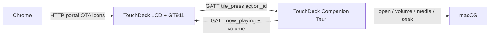
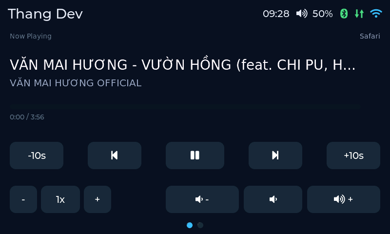

# TouchDeck — System overview & user guide

> **Languages:** [English](user-guide.md) · [Tiếng Việt](huong-dan-su-dung.md)

TouchDeck is a 7″ touch desk controller (**JC8048W550C**, ESP32-S3) for opening macOS apps and controlling volume/media through the **TouchDeck Companion** (Tauri) over **BLE GATT**. Configuration uses the Companion or the onboard web portal.

| | |
|---|---|
| Repo | https://github.com/vthang87/touchdeck |
| Intro + guide (Pages) | https://vthang87.github.io/touchdeck/ |
| Firmware installer (USB) | https://vthang87.github.io/touchdeck/setup.html |
| Buy board (AliExpress) | https://aliexpress.com/item/1005006715794302.html |
| Portal (on Wi‑Fi) | http://touchdeck.local |
| Grid editor | http://touchdeck.local/grid |

---

## 1. What’s in the system?



| Component | Role |
|---|---|
| **Board firmware** | LVGL UI (Media + shortcuts), BLE GATT peripheral, Wi‑Fi portal / OTA / icons |
| **TouchDeck Companion** (Tauri, macOS) | BLE scan/connect/auto-reconnect, Now Playing + volume → board, map `action_id` → app / volume / media |
| **Config portal** | Wi‑Fi, Bluetooth pairing, idle, device name |
| **Grid editor** | Page count (2–4) + shortcut grid (`action_id`); Media page is not edited as tiles |
| **Web installer** | Flash firmware over USB (Chrome/Edge) |

Primary channel: **Bluetooth GATT**. Wi‑Fi is for portal / OTA / icons only — no WebSocket launch.

---

## 2. On-desk screens

The device uses **2–4 pages** (default **2**). Shared header: device name · clock · volume % · Bluetooth · link · Wi‑Fi.

| Page | Content |
|---|---|
| **0 — Media** | Now Playing (title/artist, including Vietnamese fonts; progress with local time interpolation while playing; seek ±10s; transport). Bottom row: rate `− / 1x / +` on the same row as Vol− / Mute / Vol+. Companion pushes Now Playing + volume over GATT. |
| **1…N−1** | Shortcut grids (open app / URL / macro). Swipe horizontally or tap **dots** to change page. |

Horizontal swipes change page as soon as the drag passes the threshold and **do not** fire the button (Touch Router). Media looks dimmed / prompts to connect Companion when GATT is down. The last viewed page is stored in NVS.




> Screenshots are taken from LVGL on device (`GET /api/screenshot`) only when firmware is built with `-DTOUCHDECK_ENABLE_SCREENSHOT=1` (**off in production**).

**Capture again (dev):**

```bash
# Build with screenshot API enabled, then:
./scripts/capture-screenshot.sh 192.168.0.183 media-page 0
./scripts/capture-screenshot.sh 192.168.0.183 home-grid 1
```

**Status bar (right side):**

| Icon | Meaning |
|---|---|
| Clock | Local time (NTP when Wi‑Fi is up) |
| Volume % / Muted | Mac output level (Companion pushes over GATT on connect/reconnect and after Vol±/Mute; board also updates optimistically) |
| Bluetooth | Icon only — green = GATT connected; yellow = pairing; gray = idle / off |
| ⇅ | Green = companion GATT linked; gray = not linked → host tiles dimmed |
| Wi‑Fi | Green = STA; yellow = AP setup |

Mute on Media and on the shortcut **Mute** tile uses a red muted style (icon + background).

---

## 3. First-time setup

### 3.1 Flash firmware

Fastest path — Chrome/Edge + USB‑C **with data**:

1. Open the [firmware installer](https://vthang87.github.io/touchdeck/setup.html)
2. **Connect USB** → pick the ESP32‑S3 port
3. (Recommended first flash) erase flash → **Write firmware**


Or locally:

```bash
./scripts/prepare-web-firmware.sh
cd web && pnpm serve   # http://127.0.0.1:8787
```

Details: [`web-install.md`](web-install.md).

### 3.2 Wi‑Fi

1. Unconfigured board advertises AP `TouchDeck-Setup-XXXX`, password `touchdeck`
2. Open http://192.168.4.1 → SSID / password / device name / hostname / OTA password
3. **Save & Restart** → then use http://touchdeck.local


### 3.3 Bluetooth (GATT)

1. On the board: enable **Bluetooth** (+ **Pairing mode** the first time) in portal / Companion → **Device**
2. On the Mac: grant **Bluetooth** to TouchDeck Companion (System Settings → Privacy & Security → Bluetooth)
3. Companion → **Scan BLE** → **Connect** to `TouchDeck-XXXX`

This is not classic HID pairing — Companion is the GATT central. Volume/media are handled in the app (no system volume HUD from BLE HID).

### 3.4 Companion on Mac (Tauri)

**Quick download (Apple Silicon):**  
[TouchDeck-Companion-0.3.1-mac-arm64.dmg](https://github.com/vthang87/touchdeck/releases/latest/download/TouchDeck-Companion-0.3.1-mac-arm64.dmg) · [All releases](https://github.com/vthang87/touchdeck/releases/latest)

1. Open the `.dmg` → drag **TouchDeck Companion.app** to Applications  
2. Launch. If macOS blocks it: right-click → **Open** / Privacy & Security → Open Anyway  
3. **Connect** tab → **Scan BLE** → Connect  
4. Grant **Accessibility** (media / keyboard / volume)

Useful tabs:

| Tab | Purpose |
|---|---|
| **Connect** | BLE scan/connect, virtual keyboard, auto-reconnect |
| **Grid** / **Device** | Configure the board over Wi‑Fi (`touchdeck.local`) |
| **Profile** | Map `action_id` → open_app / media / volume / keyboard |
| **Log** | GATT events / errors |

After connect or reconnect, Companion pushes the current Mac volume to the deck (`volume now X%` in the Log). Now Playing is pushed while linked.

Build from source:

```bash
cd companion && pnpm install && pnpm run dist
```

Legacy Electron (WebSocket): [`../archive/companion-electron/`](../archive/companion-electron/).


When GATT is up, the ⇅ icon turns green and app tiles light up again.

---

## 4. Daily use

### 4.1 Open apps

Tap an **App** tile — Companion receives GATT `tile_press` with `action_id` and runs `/usr/bin/open` from the SQLite map.

If tiles are **dimmed**: Companion is not connected — Scan + Connect again.

### 4.2 Volume & media

All media/volume is handled by Companion (no BLE HID on the board).

- **Now Playing:** system session (Safari/YouTube, Music, Spotify, …) via MediaRemote/JXA — not limited to Music/Spotify.
- Progress time on the board advances locally while playing; host position is only hard-synced on seek / track change / pause-resume (avoids stale `pos_ms` jumping back to 0).
- **Seek ±10s:** sets playback position; does not skip tracks on seek failure.
- **Rate:** − / 1x / + (about 0.75×…2×) when the app supports it; Safari may need *Allow JavaScript from Apple Events*.
- Volume steps ~3%. **No system HUD** from the deck path. Mute / play / next / prev / seek need **Accessibility**.

### 4.3 Change deck page

Swipe horizontally between Media ↔ shortcuts, or tap the dots. A swipe that starts on a button still changes page and **does not** activate the button. Set **Total pages** 2–4 in Companion / portal **Grid**.

### 4.4 Idle screen

Defaults (editable in portal / Companion → Device):

| After | Action |
|---|---|
| 30 s | Dim to ~30% |
| 120 s | Clock screen |
| 300 s | Dim again (~30%) |
| 1800 s (30 min) | Backlight off |

Touch to wake. **The wake tap from clock/off does not fire a button** — lift, then tap again to press a tile.

While media is playing, the clock shows an extra **title — artist** line under the date.

Clock type size: **Clock font size** (48 / 72 / 96 / 128 / 160 px).

### 4.5 Cursor / Codex approval alerts

Not in MVP v4 (GATT). The old Electron companion (`archive/companion-electron/`) used WebSocket — see [`approval-notifications.md`](approval-notifications.md) (legacy).

---

## 5. Customize the shortcut grid

Open http://touchdeck.local/grid (or Companion → **Grid**):

1. Set **Total pages** (2–4; page 0 is always Media)
2. Pick the **Edit shortcut page** to change
3. Set **Columns** / **Rows** (2–5 × 1–3)
4. Per cell: `label`, `icon`, `color`, `action`, **`action_id`**
5. Action `app` may keep a legacy `target` (bundle/path) as a hint; Companion maps by `action_id`
6. Upload PNG icons to the SD card if needed
7. **Save** — applies immediately, no reboot

Companion **Profile** maps `action_id` → bundle / media / keyboard. **Grid** / **Device** talk to the same HTTP APIs as the portal.

---

## 6. Firmware updates

| Method | Command / URL |
|---|---|
| USB Web Installer | https://vthang87.github.io/touchdeck/setup.html |
| PlatformIO USB | `cd firmware && pio run -e usb -t upload` |
| OTA | `cd firmware && pio run -e ota -t upload --upload-port touchdeck.local` |

Default OTA password: `touchdeck`. Details: [`ota-process.md`](ota-process.md).

---

## 7. Quick troubleshooting

| Symptom | Check |
|---|---|
| Dim tiles / apps won’t open | Companion BLE Connected? BT icon green? |
| BLE drops / stuck “Linked” | Restart Companion — auto-reconnect re-scans without blocking disconnect. Log: `link cleared` → reconnect |
| Volume % wrong after connect | Log should show `volume now X%` right after connect/reconnect; restart Companion if not |
| Now Playing empty | Media in Control Center? Log line `Now Playing:`? |
| Mute / media dead | Accessibility for Companion? |
| Rate stuck (Safari) | Allow JavaScript from Apple Events |
| No volume HUD | Expected on v4 (no BLE HID) |
| Swipe triggers a button | Flash latest firmware (Touch Router) |
| Dim becomes fully black | Backlight PWM 1 kHz; **Dim brightness %** ≥ ~20 |
| Wake misfires a tile | Blocked by design; lift finger, tap again |
| Portal won’t open | Try IP or AP setup |
| Web Serial flash fails | Chrome/Edge, data cable, ESP32‑S3 port |

---

## 8. Related technical docs

- [Buy JC8048W550C (AliExpress)](https://aliexpress.com/item/1005006715794302.html)
- [`../companion/README.md`](../companion/README.md) — Tauri companion
- [`../archive/companion-electron/`](../archive/companion-electron/) — Electron companion (legacy)
- [`../protocol/gatt.md`](../protocol/gatt.md) — GATT protocol v4
- [`provisioning.md`](provisioning.md) — Wi‑Fi / BLE setup
- [`web-install.md`](web-install.md) — browser flash
- [`ble-protocol.md`](ble-protocol.md) — legacy v3 notes
- [`approval-notifications.md`](approval-notifications.md) — approve (legacy)
- [`ota-process.md`](ota-process.md) — OTA

---

## Images

| File | Content |
|---|---|
| `images/media-page.png` | Media page — LVGL snapshot |
| `images/home-grid.png` | Shortcut page — LVGL snapshot |
| `images/grid-editor.png` | On-device grid editor |
| `images/device-settings.png` | Portal Wi‑Fi / idle / Bluetooth |
| `images/companion-ui.png` | TouchDeck Companion |
| `images/web-installer.png` | GitHub Pages installer |
| `images/home-grid-mock.html` | HTML mock (reference only) |

---

## License

[MIT](../LICENSE) © 2026 Thang Dang
