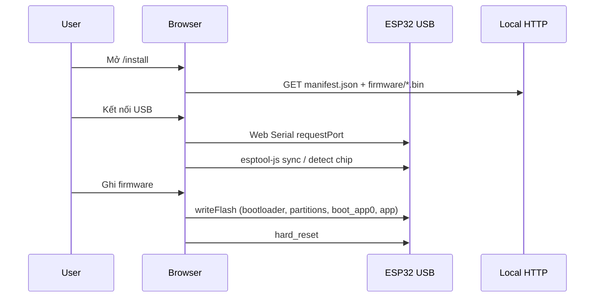

# Cài firmware ESP qua trình duyệt (Web Installer)

Trang web cho phép flash firmware TouchDeck lên board **JC8048W550C** (ESP32-S3) qua **USB** mà không cần PlatformIO hay esptool trên máy người dùng.

## Vị trí

```text
web/install/
├── index.html       # Giới thiệu + hướng dẫn sử dụng (landing)
├── setup.html       # Trình cài firmware (Web Serial)
├── installer.js     # Web Serial + esptool-js (ES module)
├── manifest.json    # Metadata + offset flash
├── assets/          # Ảnh HDSD (đồng bộ từ docs/images trên CI)
└── firmware/        # Binary (.bin) — tạo bởi script prepare
```

- Landing: https://vthang87.github.io/touchdeck/
- Flash: https://vthang87.github.io/touchdeck/setup.html

## Yêu cầu

| Thành phần | Chi tiết |
|---|---|
| Trình duyệt | **Chrome** hoặc **Edge** (desktop) — cần [Web Serial API](https://developer.chrome.com/docs/capabilities/serial) |
| Cáp USB | USB-C **có data** (không chỉ sạc) |
| Board | JC8048W550C, ESP32-S3, 16 MB flash |
| Firmware binaries | Chạy `scripts/prepare-web-firmware.sh` trước khi flash |

Safari và Firefox **không** hỗ trợ Web Serial.

## Chuẩn bị firmware

Từ thư mục gốc repo:

```bash
./scripts/prepare-web-firmware.sh
```

Script sẽ:

1. `pio run -e usb` — build firmware
2. Copy vào `web/install/firmware/`:
   - `bootloader.bin` → `0x0`
   - `partitions.bin` → `0x8000`
   - `boot_app0.bin` → `0xE000` (từ Arduino-ESP32 SDK)
   - `firmware.bin` → `0x10000`
3. Cập nhật `version` trong `manifest.json` từ `include/version.h`

Offsets khớp `partitions_16MB.csv`.

## Chạy trang cài đặt

### Cách 1 — Cloudflare Worker (khuyên dùng production)

1. Thêm GitHub Secrets: `CLOUDFLARE_API_TOKEN`, `CLOUDFLARE_ACCOUNT_ID`
2. Push `main` (production) hoặc `dev` (staging) → workflow **Deploy Cloudflare Worker**
3. Mở URL Worker tương ứng (`touchdeck-installer` / `touchdeck-installer-dev`)
4. Tạo release `git tag v0.2.0 && git push origin v0.2.0` để có firmware trên GitHub Releases

Worker inject `firmwareBaseUrl` runtime — không cần patch manifest khi deploy.

Chi tiết: [`docs/cloudflare-worker.md`](cloudflare-worker.md)

### Cách 2 — GitHub Pages (sau khi có Release)

1. Bật **GitHub Pages** (Settings → Pages → Source: **GitHub Actions**).
2. Push lên `main` → workflow **Web Installer (Pages)** deploy trang.
3. Tạo release: `git tag v0.2.0 && git push origin v0.2.0` → workflow **Firmware** build + upload `.bin`.
4. Mở `https://<user>.github.io/<repo>/` trong Chrome/Edge.

Manifest trên Pages trỏ `firmwareBaseUrl` tới `releases/latest/download` — không cần file `.bin` trong repo.

### Cách 3 — Companion (local)

```bash
cd companion
pnpm install
pnpm start
```

Menu bar TouchDeck → **Flash ESP (browser)** → mở `http://127.0.0.1:8787/`

Companion tự serve thư mục `dist/web-install/` (copy từ `web/install/` khi build).

### Cách 4 — HTTP server độc lập

```bash
cd web
pnpm install   # lần đầu
pnpm serve     # http://127.0.0.1:8787
```

Mở URL trên trong Chrome/Edge.

## Quy trình flash



1. Cắm board USB.
2. Mở trang installer.
3. **Kết nối USB** → chọn cổng serial ESP32-S3.
4. (Tuỳ chọn) bật **Xóa toàn bộ flash** lần đầu.
5. **Ghi firmware** — chờ progress 100%.
6. Board reset; Serial Monitor 115200 nếu cần debug.

## manifest.json

```json
{
  "name": "TouchDeck",
  "version": "0.2.0",
  "chipFamily": "ESP32-S3",
  "flashMode": "qio",
  "flashFreq": "80m",
  "builds": [{
    "chipFamily": "ESP32-S3",
    "parts": [
      { "path": "bootloader.bin", "offset": 0 },
      { "path": "partitions.bin", "offset": 32768 },
      { "path": "boot_app0.bin", "offset": 57344 },
      { "path": "firmware.bin", "offset": 65536 }
    ]
  }]
}
```

`flashMode` / `flashFreq` khớp `boards/jc8048w550c.json` (`qio`, 80 MHz).

Trường tuỳ chọn `firmwareBaseUrl` — CI/Pages set URL tải binary từ GitHub Releases:

```json
"firmwareBaseUrl": "https://github.com/vthang87/touchdeck/releases/latest/download/"
```

## GitHub Actions

| Workflow | File | Kích hoạt | Kết quả |
|---|---|---|---|
| **Deploy Cloudflare Worker** | `.github/workflows/cloudflare.yml` | push `main`, `dev` | Worker prod / staging |
| **Web Installer (Pages)** | `.github/workflows/pages.yml` | push `main` only | GitHub Pages (production) |
| **Firmware** | `.github/workflows/firmware.yml` | push `main`/`dev`, PR, tag `v*` | Build + Release |
| **Companion** | `.github/workflows/companion.yml` | push/PR `main`/`dev` | `pnpm build` check |

### Tạo Release firmware

```bash
git tag v0.2.0
git push origin v0.2.0
```

Workflow **Firmware**:

1. `pio run -e usb`
2. `scripts/package-firmware-bundle.sh` → `dist/release/`:
   - `bootloader.bin`, `partitions.bin`, `boot_app0.bin`, `firmware.bin`
   - `manifest.json`, `SHA256SUMS.txt`
3. Tạo **GitHub Release** với các file trên

Push/PR không tag: chỉ upload **artifact** `touchdeck-firmware` (không tạo Release).

### Bật GitHub Pages

Repository → **Settings** → **Pages** → Source: **GitHub Actions**.

Cần ít nhất **một Release** (tag `v*`) trước khi flash từ Pages — trang tải `.bin` từ `releases/latest/download`.

### CI tương đương local

```bash
pio run -e usb
RELEASE_DIR=dist/release ./scripts/package-firmware-bundle.sh web/install/firmware
```

## Flash chỉ app (nâng cấp nhanh)

Chọn file `firmware.bin` tùy chỉnh — chỉ ghi **một** part tại `0x10000`. Dùng khi bootloader/partitions không đổi.

Không dùng cho lần flash đầu hoặc đổi partition table.

## Kiến trúc code

| File | Vai trò |
|---|---|
| `web/install/installer.js` | `ESPLoader` + `Transport` từ esptool-js (CDN esm.sh), MD5 qua crypto-js |
| `companion/src/web_install_server.ts` | Static HTTP server port 8787 |
| `companion/src/main.ts` | Menu **Flash ESP (browser)**, start server on launch |
| `scripts/package-firmware-bundle.sh` | Đóng gói `.bin` + manifest (dùng local & CI) |
| `scripts/prepare-web-firmware.sh` | Build + package cho web local |
| `.github/workflows/firmware.yml` | CI build + GitHub Release |
| `.github/workflows/cloudflare.yml` | Deploy Worker (Cloudflare) |
| `.github/workflows/pages.yml` | Deploy GitHub Pages |

### Luồng `installer.js`

1. `loadManifest()` — fetch `./manifest.json`
2. `connectDevice()` — `navigator.serial.requestPort()` → `loader.main("default_reset")`
3. `loadPartsFromManifest()` — fetch từng part (local `./firmware/` hoặc `firmwareBaseUrl`)
4. `loader.writeFlash()` — `flashMode: qio`, `flashFreq: 80m`, compress + MD5
5. `loader.after("hard_reset")`

## Sau khi flash

1. Board khởi động TouchDeck firmware.
2. Cấu hình Wi‑Fi: AP `TouchDeck-Setup-XXXX` → `http://192.168.4.1/` hoặc portal trên STA.
3. Companion: Connect WebSocket port 81.
4. Cập nhật sau: OTA `pio run -e ota -t upload` hoặc flash lại qua web.

## Troubleshooting

| Vấn đề | Cách xử lý |
|---|---|
| Không thấy cổng USB | Đổi cáp data; cài driver CP210x/CH340 nếu cần; thử cổng khác |
| `Missing firmware.bin` | Chạy `./scripts/prepare-web-firmware.sh` hoặc tạo GitHub Release |
| Pages không tải được bin | Tạo tag `v*` trước; kiểm tra Release có đủ 4 file `.bin` |
| Web Serial không có | Dùng Chrome/Edge; không mở qua iframe |
| Chip không phải S3 | Kiểm tra đúng board JC8048W550C |
| Flash lỗi / boot loop | Bật **Xóa toàn bộ flash**, flash lại full 4 parts |
| Port 8787 bận | Tắt process khác hoặc `cd web && pnpm serve` port khác |

## Bảo mật

- Companion server bind `127.0.0.1` — không expose LAN.
- GitHub Pages + Releases: binary public trên GitHub (phù hợp open-source firmware).

## Liên quan

- [`README.md`](../README.md) — tổng quan project
- [`docs/provisioning.md`](provisioning.md) — Wi‑Fi sau flash
- [`docs/ota-process.md`](ota-process.md) — OTA wireless update
